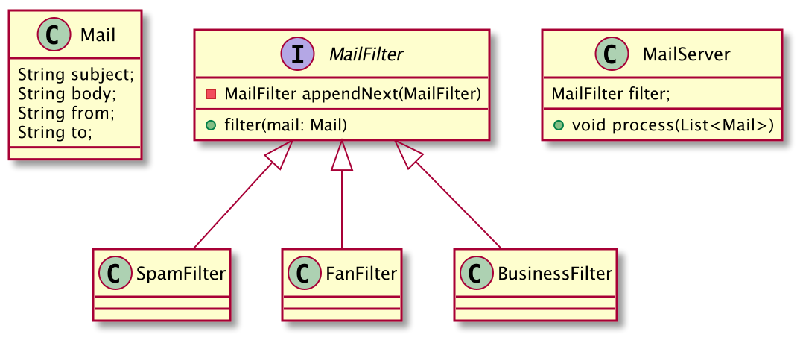
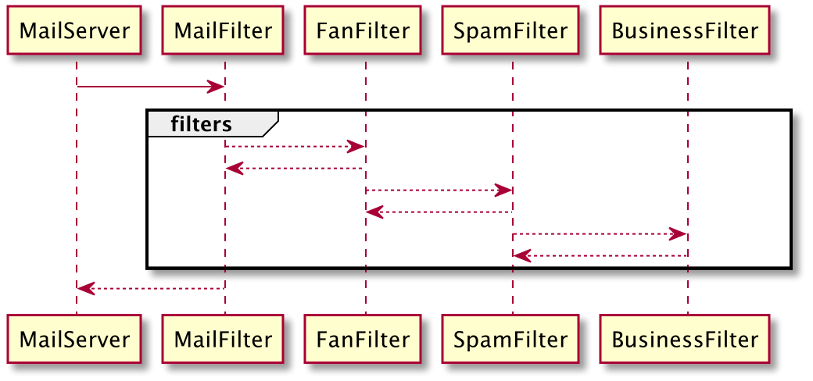

Chain of responsibility pattern is behavioural pattern from G.O.F book about design patterns, this pattern is very useful when you need to decouple the sender from its receivers and each receiver has some responsibility to fulfill.

Let's understand this with an example, suppose you have a mail server, and you have already identified ways to identify
spam, fan, business, complaining mails from normal mails, and you are asked to implement this logic into the mail server,
so that it automatically filters these mails and perform some logic, for example:
* Spam needs to be ignored.
* Fan mails needs to be forwarded directly to CEO of company.
* Business mails needs to be forwarded to business email in company.
* Complaint mails need to be directed to Consumer department.

Now, we can simply put if and else-if checks in our logic and accomplish the requirement, but it will be problematic for
few reasons:
* We will be violating open-close principle, because whenever we need to add new rule we would change our function.
* We will also be breaking the single responsibility principle as the function would be doing a lot of things on its 
own.

Better approach would be if we have different handlers for each responsibility i.e. filtering spam, fan and then 
somehow combine them together, which will then handle the request object one by one. This is what COR helps
us to do. Let's take a look at the implementation of this pattern to solve our problem at hand, given below is the UML 
diagram of the classes involved.

> Let's refer the Chain of responsibility pattern with COR now onwards.



Here, `MailFilter` is the functional interface with abstract `filter` method, which will be then implemented by every concrete
class i.e. `SpamFilter`, `FanFilter`, so each filter will provide its own implementation for filter logic.

`MailServer` class is the sender class which will send the mail object to handler assigned to it, in actual 
implementation it would not know if there are more than one handler and which handler it is interacting with.



## Implementation
For the implementation I have chosen the functional interface instead of abstract class for `MailHandler` above since 
there is only one abstract method.

```java

@FunctionalInterface
public interface MailFilter {
    default MailFilter appendNext(MailFilter next) {
        return mail -> {
            filter(mail);
            next.filter(mail);
        };
    }

    void filter(Mail mail);
}
``` 
*Notice* that `appendNext` function is giving same interface(implementation) back to the caller here, also it is calling
first the `filter` method(which would be of concrete class) and then it calls the `next.filter(mail)` method on next 
handler in chain.

Now, lets look at one of the concrete implementation of this interface `SpamFilter`
```java
class SpamFilter implements MailFilter{
    private final List<String> allowedMails = Arrays.asList(
            "abc@xyz.com",
            "zyz@abc.com",
            "kuldeep.yadav@xyz.com",
            "johnoliver@xyz.com",
            "vincent@rocketmail.com"
    );

    @Override
    public void filter(Mail mail) {
        if(isSpam(mail)) {
            System.out.println("Ignoring spam mail");
        }
    }

    private boolean isSpam(Mail mail) {
        return !allowedMails.contains(mail.from());
    }
}
```
As you can see the `SpamFilter` class implements the `MailFilter` interface, so it provides the logic for `filter` method
which will then check if the `Mail` object can be filtered and if true then it will process (In this case only printing
on console).

> The filtering logic in above example is just for demo purpose, please don't use it in production :)

Similarly, there would be other filters in the chain which will process the `Mail` object and work on it if the 
logic/condition passes. Let's see how it is being used by the sender/client.
```java
class MailServer {
    private final MailFilter filter;

    public MailServer() {
        filter = init();
    }

    private MailFilter init() {
        return new SpamFilter()
                .appendNext(new FanFilter())
                .appendNext(new BusinessFilter());
    }

    public void process(List<Mail> mails) {
        mails.forEach(filter::filter);
    }
}
```
Here for the demo purpose I have chosen to define the chain in the same class but in real scenario, you may want to have
some strategy or factory which will generate this chain and give you the `filter` object to deal with in your code. Here, we need
to check only the `process` method which is receiving list of mails and process them one by one.

You can see that this is much cleaner solution than if-else chain in your code and also decouples the sender from the 
handler/filter(s) in this case, for example if there was a separate class to initialise the chain, the `MailServer`
class would not even know how many filters the mail object would go through, hence we can directly add or remove filters
from chain any time without touching the `MailServer` class.

Also, every filter logic resides in its own class, which follows the SRP(Single Responsibility principle) as well.

### Disadvantages
As with every thing in software world, this pattern is also not a magic bullet and comes with cons as well
* If the chain is very long, it is hard to debug and verify where the problem lies.
* With very long chain of handlers, the call stack will grow as well, and it could lead to performance issues.
* It can lead to duplicate code among handlers, although duplication can be avoided.

### Points To Consider Before Use
* Use it when you don't need the guarantee that the request object must be executed by all the handlers, otherwise use
the decorator pattern.
* Use it when multiple handlers must be able to process a request object, and you don't want sender to have any idea
about multiple handlers.
* Don't use it when the client must know the handler which will execute the request.

### Conclusion

COR design pattern helps to decouple the sender from its receivers, the request sent by sender can be handled by
multiple handlers or receivers without sender knowing it, which will then gives flexibility to remove or add the receivers
without touching the code of sender. `javax.servlet.Filter` API is nice example of this pattern implemented in java
world, another good case of this pattern is logging, [wikipedia](https://en.wikipedia.org/wiki/Chain-of-responsibility_pattern)
mention this example with implmentation. But COR pattern also have its downsides so as a developer we must be aware of
these.

### References
* [Chain of Responsibility pattern wikipedia](https://en.wikipedia.org/wiki/Chain-of-responsibility_pattern)
* [Head First Design Pattern book](https://www.oreilly.com/library/view/head-first-design/0596007124/)
* [Source code for above example](https://github.com/novicedev7291/design-patterns)